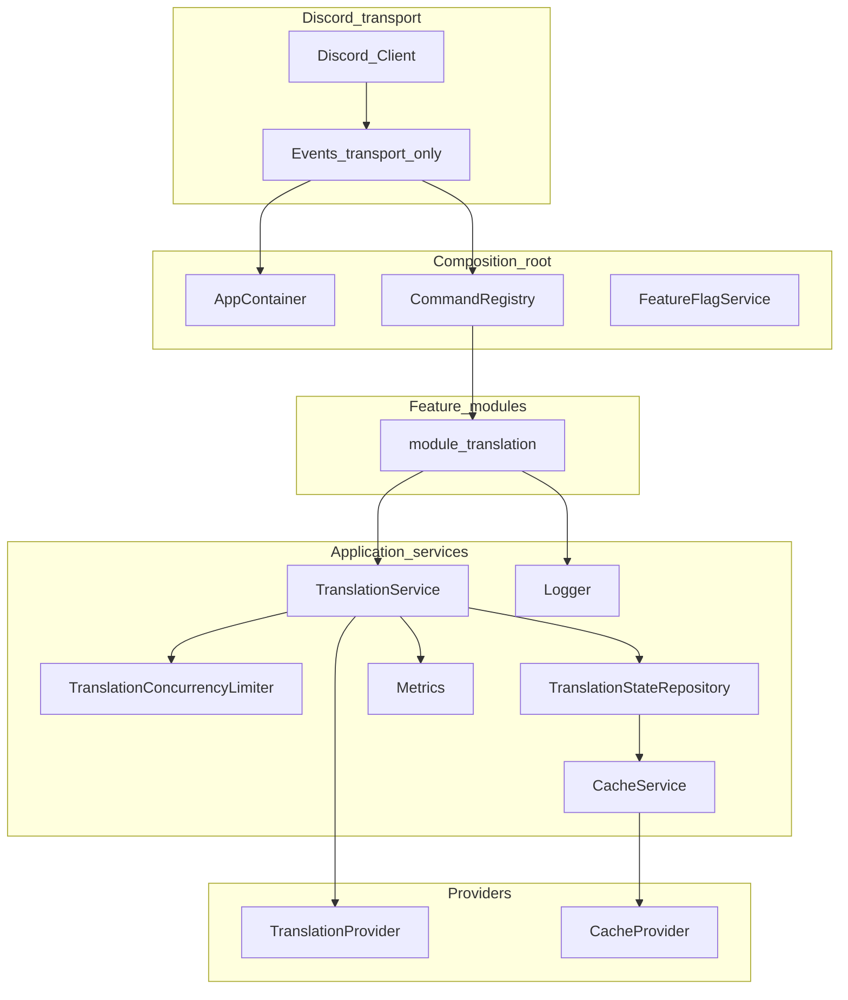
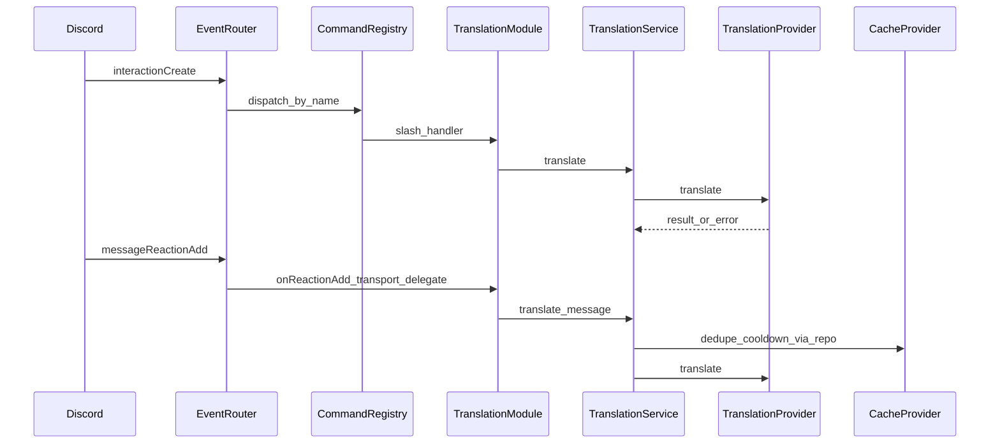

# Nothing Bot — production architecture plan (translation MVP)

## Executive summary

Build **[Nothing Bot](d:\project\discord bot\Nothing bot)** as a **composition-root + DI container + modules + services + providers** system. Business logic for translation lives in **`TranslationService`** and **`modules/translation`**. External volatility (translation backends, cache backends, Discord API quirks, telemetry backends) stays behind **interfaces** (`TranslationProvider`, `CacheProvider`, `Metrics`, repositories).

**Events are transport-only**: parse Discord payloads, resolve IDs, delegate to the **command registry** or **module entrypoints**. **No translation rules, cache keys, cooldown math, or “ignore bot” logic** in `src/events/*`.

**MVP choices (confirmed)**

- **Translation**: unofficial Google Translate client **only inside** `GoogleTranslateProvider` (never imported by commands/events directly).
- **Dedup + spam**: TTL **in-memory** via `MemoryCacheProvider` behind **`CacheService`** and **`TranslationStateRepository`** (Redis/Postgres-ready seam).

**Package manager**: **npm** (`package-lock.json`). Do **not** use pnpm for this project.

**Production caveat**

- Unofficial translation libraries trade convenience for **ToS / breakage risk**. The **`TranslationProvider`** + **timeout** + **metrics** exist so you can migrate to **Google Cloud Translation, DeepL, Azure, OpenAI**, etc., without rewriting slash/reaction workflows.

**Engineering posture**

- **Standard layout** — conventional Node/TypeScript `src/` tree (not ad-hoc hobby structure).
- **Clean & optimized** — small focused files, explicit boundaries, no premature abstractions, no dead/placeholder code in MVP.
- **Experienced-developer rules** — SOLID where it pays off, DRY without cleverness, config-driven behavior, strict typing, lint-enforced consistency.

---

## Approved architecture additions (layered on top of baseline below)

These extend—not replace—the baseline architecture in the following sections.

### 1) Centralized dependency injection / service container

- **[`src/core/container.ts`](d:\project\discord bot\Nothing bot\src\core\container.ts)** (or `src/app/container.ts`): `AppContainer` / `createContainer(config)` constructs **`Logger`**, **`Metrics`**, **`FeatureFlagService`**, **`CacheService`**, repositories, **`TranslationConcurrencyLimiter`**, **`TranslationService`**, **`CommandRegistry`**, and wiring for modules.
- Modules depend on **ports** (interfaces), not globals.
- Tests build a container with **mock** ports.

### 2) Formal command registry architecture

- **[`src/commands/registry.ts`](d:\project\discord bot\Nothing bot\src\commands\registry.ts)**: typed `SlashCommandDefinition` (`name`, `builder`, `handler`), `register()`, **`getHandler(commandName)`**.
- **`scripts/deploy-commands.ts`**: REST deploy using env (`DISCORD_TOKEN`, `DISCORD_CLIENT_ID`, optional `DISCORD_GUILD_ID` for guild-specific speed during dev).
- **`interactionCreate`** only looks up `interaction.commandName` and invokes the handler (transport-only).

### 3) Feature flag system

- **`src/config/feature-flags.ts`** + env, e.g. `FEATURE_TRANSLATION_SLASH`, `FEATURE_TRANSLATION_REACTION`.
- **`FeatureFlagService`** centralizes reads; handlers or bootstrap decide disabled behavior (early-return message vs omitting registration—pick one consistent policy per flag).

### 4) Cache namespaces strategy

- **`src/cache/namespaces.ts`**: canonical prefixes, e.g. `translation:dedupe`, `translation:cooldown`, optional `translation:response`.
- Keys: `` `${namespace}:${stableId}` `` where `stableId` includes guild/channel/message/targetLang as needed.
- **`CacheService`** always prefixes or exposes `withNamespace(ns)` so future features cannot collide.

### 5) Metrics / telemetry abstraction interface

- **`src/telemetry/types.ts`**: `Metrics` (`increment`, `histogram` / timings as appropriate).
- **`src/telemetry/noop.ts`**: MVP default.
- Translation path: e.g. `translation.requests`, `translation.failures`, timing/latency for provider calls.

### 6) Translation provider timeout protection

- Wrapper around **`TranslationProvider.translate`** (or shared `withTimeout`) using **`TRANSLATION_TIMEOUT_MS`** from Zod config.

### 7) Safe Discord reply utility wrappers

- **`src/discord/replies.ts`**: `safeReplyInteraction`, `safeReplyMessage` / channel send helpers; central handling for **10062** (unknown interaction), **50013** (missing permissions), already-replied/deferred guards.

### 8) Dedicated embed builder layer

- **`src/discord/embeds.ts`**: `translationResultEmbed(...)`, `errorEmbed(...)`. Feature modules **do not** scatter raw `EmbedBuilder` usage.

### 9) Repository boundary for future persistence

- **`src/database/repositories/translation-state.repository.ts`**: interface for **dedupe locks**, **cooldowns**, etc.
- MVP: **`InMemoryTranslationStateRepository`** implemented via **`CacheService`** (actively **used** by `TranslationService`, not a dead stub).

### 10) Translation concurrency limiter / queue strategy

- **`TranslationConcurrencyLimiter`**: global max concurrent translations (`TRANSLATION_MAX_CONCURRENT`); fair **per-guild** scheduling can be phase 2.
- Call chain recommendation: **limiter → timeout → provider**.

### 11) Strict enforcement: events remain transport-only

- Allowed in **`src/events/*.ts`**: type-narrow, extract primitives, call **`commandRegistry.dispatch`** or **`translationModule.onReactionAdd(...)`**.
- **Forbidden**: language detection, emoji-to-locale tables, dedupe/cooldown logic, ignoring bots, truncation—those live in **`modules/`** and **`services/`**.
- Enforcement: small files + review checklist.

---

## 1) System architecture (layers)



**Dependency rule**: `modules/*` may call `services/*`, `discord/*`, `shared/*`. **`providers/*` and `telemetry/*` implementations** must **not** import Discord.js (keeps unit tests and swapping vendors cheap). **`discord/*`** may import Discord.js by design.

---

## 2) Standard folder structure

Follow a **conventional Node/TypeScript backend layout**: one entrypoint, all runtime code under **`src/`**, scripts outside `src/`, config at repo root. **Do not** mix feature logic at repo root or create parallel “helper” folders without a defined role.

### Repository layout (root)

```
nothing-bot/
├── .env.example
├── .gitignore
├── eslint.config.js
├── package.json
├── package-lock.json
├── prettier.config / .prettierrc
├── tsconfig.json
├── vitest.config.ts
├── scripts/
│   └── deploy-commands.ts      # CLI only; no business logic
└── src/
    ├── index.ts                # thin entry: load env → createContainer → bootstrap
    ├── config/
    ├── core/
    ├── commands/
    ├── events/
    ├── modules/
    ├── services/
    ├── providers/
    ├── cache/
    ├── database/
    ├── discord/
    ├── telemetry/
    ├── shared/
    ├── utils/
    └── types/
```

**Root rules**

- **`src/index.ts`** — composition only (~20–40 lines): validate config, build container, start bot, register shutdown.
- **`scripts/`** — deploy, migrations, one-off tooling; never import Discord handlers from here into runtime paths.
- **No `lib/` + `src/` duplication** — compiled output goes to **`dist/`** only.

### `src/` tree (canonical)

```
src/
├── index.ts
├── config/
│   ├── env.schema.ts           # Zod schema
│   ├── index.ts                # loadConfig(), export AppConfig type
│   ├── feature-flags.ts
│   └── constants.ts            # limits, TTL defaults (not secrets)
├── core/
│   ├── client.ts               # createDiscordClient()
│   ├── container.ts            # AppContainer + createContainer()
│   ├── bootstrap.ts            # registerEvents, registerModules, login
│   └── shutdown.ts             # SIGINT/SIGTERM graceful close
├── commands/
│   ├── registry.ts
│   ├── types.ts
│   └── index.ts                # barrel: registerAllCommands(registry)
├── events/
│   ├── index.ts                # registerEvents(client, ctx)
│   ├── interaction-create.event.ts
│   ├── message-reaction-add.event.ts
│   └── ready.event.ts
├── modules/
│   └── translation/
│       ├── index.ts            # registerTranslationModule(ctx)
│       ├── translation.module.ts
│       ├── commands/
│       │   └── translate.command.ts
│       ├── handlers/
│       │   ├── translate-slash.handler.ts
│       │   └── translate-reaction.handler.ts
│       ├── language-map.ts
│       └── translation.policy.ts
├── services/
│   ├── translation/
│   │   ├── translation.service.ts
│   │   └── translation-concurrency-limiter.ts
│   ├── cache/
│   │   └── cache.service.ts
│   └── feature-flags/
│       └── feature-flag.service.ts
├── providers/
│   ├── translation/
│   │   ├── translation-provider.interface.ts
│   │   ├── google-translate.provider.ts
│   │   └── timeout-translation.provider.ts
│   └── cache/
│       └── memory-cache.provider.ts
├── cache/
│   ├── cache-provider.interface.ts
│   └── namespaces.ts
├── database/
│   └── repositories/
│       ├── translation-state.repository.ts
│       └── in-memory-translation-state.repository.ts
├── discord/
│   ├── embeds.ts
│   └── replies.ts
├── telemetry/
│   ├── metrics.interface.ts
│   └── noop-metrics.ts
├── shared/
│   ├── errors/
│   │   ├── app.error.ts
│   │   ├── provider.error.ts
│   │   └── user-facing.error.ts
│   ├── handler/
│   │   └── run-handler.ts
│   └── async/
│       └── with-timeout.ts
├── utils/
│   ├── emoji/
│   │   └── parse-flag-emoji.ts
│   └── text/
│       └── truncate-for-discord.ts
└── types/
    └── index.ts                # re-export shared domain types only
```

### Folder responsibilities (quick reference)

| Path | Role |
|------|------|
| `config/` | Env validation, feature flags, numeric limits — **no** Discord imports |
| `core/` | App lifecycle: client, DI container, bootstrap, shutdown |
| `commands/` | Slash command **registry** (not feature handlers) |
| `events/` | **Transport-only** Discord event wiring |
| `modules/<feature>/` | Feature UX + orchestration calls into `services/` |
| `services/` | Application use-cases; **no** `discord.js` in translation/cache services |
| `providers/` | External I/O adapters (translate API, memory cache) |
| `cache/` | Contracts + namespace constants |
| `database/repositories/` | Persistence **ports** + MVP implementations |
| `discord/` | Discord.js-specific presentation (embeds, safe replies) |
| `telemetry/` | Metrics port + noop |
| `shared/` | Cross-cutting primitives (errors, handler wrapper, timeout util) |
| `utils/` | Pure functions (emoji parse, truncate) — easy to unit test |
| `types/` | Shared TS types when not colocated with a module |

### Naming & file conventions

- **Files**: `kebab-case.ts` (e.g. `translate-slash.handler.ts`).
- **Types/classes**: `PascalCase`; **functions/vars**: `camelCase`; **constants**: `SCREAMING_SNAKE` in `config/constants.ts` only.
- **One primary export per file** where practical; use **`index.ts` barrels** only at folder boundaries (`commands/`, `modules/translation/`, `config/`) — avoid deep re-export chains.
- **Suffixes** (predictable discovery):
  - `*.service.ts` — application services
  - `*.provider.ts` / `*.repository.ts` — adapters
  - `*.handler.ts` — Discord command/reaction handlers
  - `*.event.ts` — event transport files
  - `*.interface.ts` — ports when not co-located with impl
  - `*.policy.ts` — pure domain rules (no I/O)
  - `*.test.ts` — colocated next to util or under same feature folder

### Import boundaries (enforced by convention + ESLint)

Allowed dependency direction (top → bottom only):

```
events → commands, modules
modules → services, discord, shared, utils, types, config (types only)
services → providers, cache, database, telemetry, shared, config
providers → shared, types (no discord.js)
discord → shared, types
core → everything needed for composition (single composition root)
```

**Forbidden**

- `providers/*` or `services/*` importing **`discord.js`**
- `events/*` importing **`providers/*`** or translation vendor packages
- Circular imports between `modules` and `services`
- Feature modules importing another feature module directly (use shared services later)

### `jobs/` and future folders

- **`src/jobs/`** — add only when first real scheduler/queue is implemented; **no empty stub** in MVP.
- **`src/api/`** — future dashboard REST; separate process recommended.

---

## 2b) Clean code & experienced-developer standards

These rules apply to **every implementation phase** and are checked at review/lint time.

### Structure & size

- **Single responsibility** — each file does one job; split when a file exceeds ~150–200 lines or mixes transport + domain logic.
- **Thin handlers** — slash/reaction handlers: parse input → call service → map result to embed/reply; **no** provider calls in handlers.
- **Pure functions first** — emoji parsing, key building, truncation live in `utils/` or `*.policy.ts` with unit tests.
- **No god objects** — `AppContainer` holds references; it does not implement business logic.

### Code quality

- **TypeScript `strict`** — no `any`; prefer `unknown` + narrowing; use `interface` for ports, `type` for unions/DTOs.
- **Explicit return types** on exported public functions and service methods.
- **Async safety** — `async/await` + `try/catch` at boundaries (handler wrapper, provider adapter); do not swallow errors silently.
- **No magic numbers/strings** — limits, TTLs, timeouts in `config/constants.ts` or Zod-derived config.
- **Immutability where cheap** — prefer `readonly` on config/DTO fields; do not mutate shared cache keys/objects in place.

### Optimization (pragmatic, not premature)

- **Early returns** in reaction path (invalid emoji, bot message, empty content) before `fetch()` or translate.
- **Avoid redundant Discord API calls** — fetch message once; reuse partial resolution logic in one helper.
- **Dedupe + cooldown before provider** — never call translate if lock/cooldown fails.
- **Bounded memory** — cache provider supports TTL + optional max entries; document eviction behavior.
- **Do not micro-optimize** — clarity and correct boundaries beat hand-rolled caches unless profiling proves need.

### What we avoid in MVP

- Placeholder classes/interfaces that are **never wired** (no “future” empty `JobScheduler` in tree).
- Duplicate embed/reply logic outside `discord/`.
- Copy-paste between slash and reaction handlers — share via `TranslationService` + embed builders.
- Over-abstracted factories beyond the DI container and provider decorators (timeout, limiter).
- Comments that restate the code; comments only for non-obvious invariants (e.g. dedupe key shape).

### Tooling gates (every phase)

| Gate | Command |
|------|---------|
| Compile | `npm run build` |
| Lint | `npm run lint` |
| Format | `npm run format:check` |
| Test | `npm test` |

ESLint recommendations: `@typescript-eslint/consistent-type-imports`, `no-unused-vars` (underscore ignore for `_ctx`), ban `console.log` in `src/` (use logger).

### Review checklist (before merging a phase)

- [ ] No business logic in `src/events/`
- [ ] No `discord.js` in `providers/` or core `services/`
- [ ] New env vars added to `.env.example` + Zod schema
- [ ] Handlers use `runHandler` + safe reply helpers
- [ ] Metrics incremented on success/failure paths
- [ ] File/folder names match conventions above

---

## 3) Module responsibilities

| Area | Responsibility |
|------|----------------|
| `core` | Constructs Discord client (**GatewayIntents**, **Partials** for reactions/messages), wires **`AppContainer`**, registers transport listeners, graceful shutdown. |
| `commands` | Registry of slash definitions + lookup by name; **no** domain logic. |
| `events` | **Transport-only**: dispatch to registry or module entrypoints. |
| `modules/translation` | User-visible translation behavior + Discord UX (calls embed/reply helpers). |
| `services` | Orchestration: dedupe, cooldowns (via repo), truncation policy, metrics, limiter, timeout-wrapped provider calls. |
| `discord` | Embeds + safe replies (centralized API error behavior). |
| `providers/*` | Vendor adapters (translate API, memory cache). |
| `database/repositories` | Persistence **ports** for translation-related ephemeral state (MVP: memory/cache-backed). |
| `telemetry` | Observability **port**; noop in MVP. |
| `config` | Single source of truth for limits, TTLs, flags, provider tuning. |
| `shared` | Error taxonomy + reusable guards/utilities. |

---

## 4) Data flow (conceptual)

**Slash translate**

1. Discord emits `interactionCreate` → event file validates type → **`CommandRegistry`** resolves handler for `translate`.
2. Handler reads options (`text`, `language`), validates non-empty / max length (config).
3. **`TranslationService`** (via container):
   - optional **feature flag** gate
   - **cooldown** / **dedupe** via **`TranslationStateRepository`** + cache namespaces
   - **`TranslationConcurrencyLimiter`** acquire
   - **`TranslationProvider`** behind **timeout**
   - **`Metrics`** record success/failure/latency
4. Reply via **`safeReplyInteraction`** + **`translationResultEmbed`** (ephemeral default for privacy).

**Reaction translate**

1. Discord emits `messageReactionAdd` → event extracts IDs/reaction → **`translationModule.onReactionAdd`** only.
2. Module resolves emoji → target language (**invalid → silent return**).
3. Fetch full message if partial; **ignore bots**, empty content, unsupported targets (**policy**).
4. Repo checks **dedupe** (`guildId:channelId:messageId:targetLang`) and **per-user cooldown**; then same translation pipeline as slash.
5. Respond with **`safeReplyMessage`** / channel send + embed (**no ephemeral** on reactions).

---

## 5) Event flow



---

## 6) Translation workflow (`/translate`)

- Command builder respects Discord option limits; enforce **stricter** max in config before hitting provider.
- Normalize language option to **canonical locale codes** (`hi`, `en`, …).
- **Unsupported language**: standardized **`errorEmbed`** + list/map pointer to supported codes.
- **Dedupe** (optional for slash): short TTL on `(userId, hash(text), targetLang)` to mitigate double-submit spam; interactions are usually unique by id anyway.

---

## 7) Reaction workflow

- **Regional indicator parsing**: pair `U+1F1E6..U+1F1FF` → ISO alpha-2 → **explicit** map to target locale (e.g. `IN` → `hi`).
- **Invalid / non-flag emoji**: ignore (no user-visible noise).
- **Duplicate reactions / concurrent users**: **dedupe** key `guildId:channelId:messageId:targetLang` + TTL prevents duplicate bot outputs; **single-flight** semantics via repo **tryAcquire** pattern where applicable.
- **Spam**: per-user cooldown key e.g. `guildId:userId:reactTranslate` with short TTL.
- **Deleted messages / missing permissions**: catch Discord REST errors in **`discord/replies`** layer; log + metrics.

---

## 8) Error handling strategy

- **`UserFacingError`**: safe Discord-facing message (no stacks).
- **`ProviderError`**: upstream translation failures → mapped to generic “translation unavailable” + metric.
- **`DiscordOpsError`** (or equivalent): permissions, unknown interaction, deleted channel/message—central mapping in reply helpers.

**Handler wrapper**

- `runHandler`-style wrapper: one logical reply, structured log context (`guildId`, `channelId`, `messageId`, `command`, durations), unknown errors → generic user message + error log.

**Discord-specific**

- Always guard `deferred` / `replied` before responding.
- Map **`DiscordAPIError`** codes consistently (50013, 10062, …).

---

## 9) Logging strategy

- **`pino`** structured logs with **token redaction**.
- Fields: `level`, `msg`, `time`, correlation (`interactionId`, `messageId`), `durationMs` around provider calls.
- **`info`**: startup/ready; avoid logging raw message content by default (privacy/compliance)—prefer lengths/hashes when debugging.

---

## 10) Scalability strategy

- **Single instance MVP**: in-memory TTL cache + lazy expiry + optional max-entry safeguard.
- **Horizontal scale later**: swap **`MemoryCacheProvider`** → **`RedisCacheProvider`**; move repository backing state to Redis for cross-instance dedupe/cooldown correctness.
- **Sharding**: keep client creation in `core`; reaction handlers tolerate partials and **`fetch()`** when needed.
- **Large guilds**: cheap early exits (emoji parse, bot check) before network/provider calls.

---

## 11) Future expansion strategy

- **Plugins/modules**: each module receives **`AppContainer`** (or a narrowed context) at registration.
- **Workers/queues**: add queue-backed **`jobs`** without changing `TranslationService` contract (enqueue heavy AI later).
- **Dashboard/API**: separate **`src/api`** process or module; share **`src/types`**.
- **Premium**: entitlement checks in **policy** / **services**, not scattered `if` in events.

---

## 12) Suggested packages

- **`discord.js`** v14+, **`dotenv`**, **`typescript`**
- **`zod`** — env + runtime validation
- **`pino`** (+ `pino-pretty` dev)
- **`google-translate-api-x`** — **only** inside `GoogleTranslateProvider`
- **ESLint** + **`typescript-eslint`**, **Prettier**
- **`tsx`** for dev / scripts
- **`vitest`** for unit tests

Install and run with **npm** only.

---

## 13) Security considerations

- Protect **`DISCORD_TOKEN`**; never log it; rotate on leak.
- **Least-privilege intents**; add intents only when features require them.
- Treat translated content as **sensitive**; unofficial providers imply third-party handling—plan migration to official APIs for compliance-minded deployments.
- **Abuse**: cooldown + dedupe + concurrency cap + metrics visibility.

---

## 14) Rate limit strategy

- Rely on **discord.js** REST queueing; avoid fan-out bursts from reactions.
- **Translation**: timeout + global concurrency limit + dedupe to protect upstream and your process.
- Optional limited retries with jitter for **transient** provider failures (keep MVP simple; document behavior).

---

## 15) Deployment considerations

- **Node 20+** LTS recommended.
- Process manager (**PM2**, systemd) or container (**Docker**) with restart policy.
- **Health**: structured “ready” log; future **`/healthz`** via API module.
- **12-factor config**: env vars for token, app id, guild id (dev), TTLs, timeouts, concurrency, flags.

---

## Phased implementation (baseline phases + verification gates)

Each phase should **`npm run build`**, **`npm run lint`**, and **`npm test`** once tests exist. After Discord bootstrap, manual smoke with a real token.

**Planning / product**

1. Freeze MVP defaults (dedupe TTLs, cooldowns, embed truncation rules, ephemeral slash policy).

**Engineering phases**

2. **Folder architecture** — create tree aligned with **section 2** (standard layout + naming suffixes); add `index.ts` barrels only where specified.
3. **Environment setup** — npm scripts, TS **strict**, ESLint (import boundaries + no console), Prettier, Vitest, `.env.example`.
4. **Discord client bootstrap** — intents/partials, login, ready logging, shutdown hooks.
5. **Logging** — pino + redaction; container exposes logger.
6. **DI container + feature flags + telemetry noop** — single composition root.
7. **Cache + namespaces + MemoryCacheProvider + CacheService**.
8. **Repository boundary** — `TranslationStateRepository` backed by cache.
9. **Discord layer** — embeds + safe replies.
10. **Translation provider layer** — interface, unofficial Google impl, **timeout**, **concurrency limiter**, **`TranslationService`**.
11. **Command registry + deploy script + `/translate`**.
12. **Events (transport-only)** — wire registry + reaction delegate.
13. **Reaction translation** — flag map + fetch message + policies.
14. **Validation / error handling** — Zod completeness, handler wrapper, Discord code mapping.
15. **Testing / debugging** — vitest for pure utils + mocked ports; colocate `*.test.ts` per **section 2b**.
16. **Engineering standards pass** — lint/format/build/test; verify import boundaries and no dead code.
17. **Production readiness notes** — swapping provider, Redis repo backing, Docker/PM2 optional.

---

## Defaults (codified in config)

- Slash replies: **ephemeral** where supported (privacy-friendly default).
- Reaction replies: **channel** reply referencing context; **dedupe** prevents spammy duplicates.
- Long content: **truncate** with explicit embed footer/field indicating truncation.
